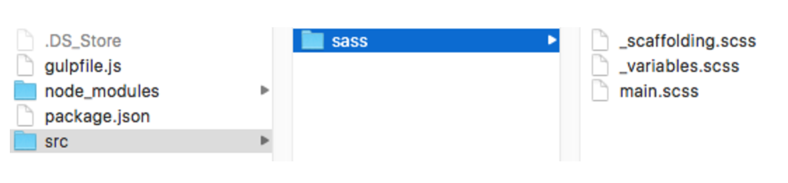
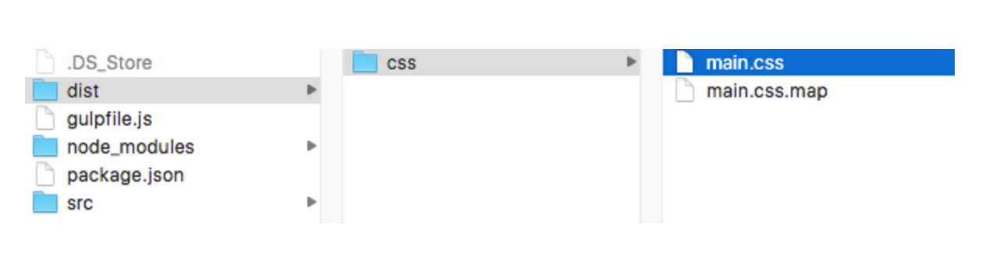

# as3 - Gulp

## Install Gulp Globally

This will install the Gulp command line, globally.

```
npm install --global gulp-cli
```

## Install Node and Gulp Locally

> cd projecto

In order to install Node locally, you need a package.json file.
```
npm init
```
This command will walk you through creating a generic package.json. It’s pretty straightforward, and simply press enter if you’re not sure or don’t want to fill something in

Now we’ll run a command to install Node and Gulp.

```
npm install --save-dev gulp
```
this create a node_module file with 159 items.

Once that’s complete, you can list your files:

> ls

```
node_modules   package.json
```

## Install Gulp Plugins

I start with sass, but if add another before gulp-[pluginName]

```
npm install --save-dev gulp-sass gulp-cssnano gulp-sourcemaps gulp-autoprefixer
```
## Set Up Project

The last thing we need to do is set up a file named gulpfile.js, which is a JavaScript file that will define the entire task running process.

Create a gulpfile.js.

and add the next code:

```
'use strict';

var gulp = require('gulp');

// our plugins

var sass = require('gulp-sass');

// Compile Our Sass
gulp.task('sass', function() {
    return gulp.src('css/*.scss')
        .pipe(sass())
        .pipe(gulp.dest('dist/css'));
});

// Default Task
gulp.task('default', ['sass']);

```

Now to test this code, I’m going to create three simple .scss files – main.scss, ```_variables.scss```, and ```_scaffolding.scss```.

### main (main.scss)
```
/* Main SCSS File */

// Base
@import "variables";

// Components
@import "scaffolding";
```

### variable (```_variables.scss```)
```
// Typography

$font-style: normal;
$font-variant: normal;
$font-weight: normal;
$font-color: #222;
$font-size: 1rem;
$line-height: 1.5;
$font-family: Helvetica Neue, Helvetica, Arial, sans-serif;
```

### scaffolding(```_scaffolding.scss```)
```
// Define typography
html {
  font: $font-style $font-variant $font-weight #{$font-size}/#{$line-height} $font-family;
}

// Vertically center anything
.vertical-center {
  display: flex;
  align-items: center;
  justify-content: center;
}
```


All you need to do now is type the gulp command at the root of your project directory.
```
gulp
```
if work a *dist* file is created




